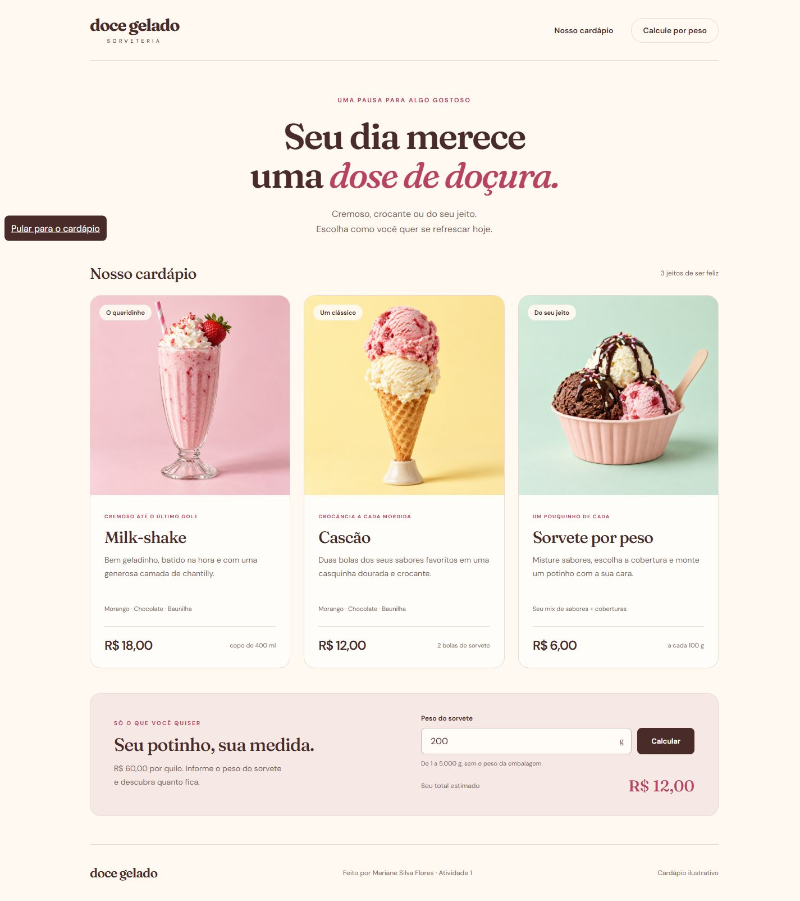
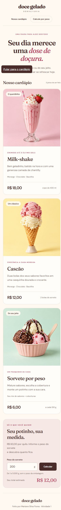

# Doce Gelado — Cardápio de sorveteria

Projeto da Atividade 1: um cardápio em HTML, CSS e JavaScript com milk-shake, cascão e sorvete por peso.

Autora: [Mariane Silva Flores](https://github.com/marianesilvaflores).

**[Abrir cardápio](https://marianesilvaflores.github.io/sorveteria-cardapio/)** · **[Ver commits](https://github.com/marianesilvaflores/sorveteria-cardapio/commits/main/)**



## Sobre o projeto

Doce Gelado é uma sorveteria fictícia. O cardápio apresenta três opções:

| Produto | Preço ilustrativo |
| --- | --- |
| Milk-shake de 400 ml | R$ 18,00 |
| Cascão com duas bolas | R$ 12,00 |
| Sorvete por peso | R$ 6,00 por 100 g (R$ 60,00/kg) |

A calculadora aceita pesos inteiros de 1 a 5.000 gramas, sem incluir a embalagem. O total é calculado a partir de R$ 60,00 por quilo e exibido no formato brasileiro. Exemplo: **250 g = R$ 15,00**. O site não recebe pedidos nem pagamentos.

## Requisitos da Atividade 1

| Requisito | Evidência |
| --- | --- |
| No mínimo 15 commits | Histórico com mais de 15 commits em português |
| Arquivos HTML, CSS e JS | `index.html`, `style.css` e `script.js` |
| README | Este documento |
| Pasta `img` com três imagens | `milkshake.png`, `cascao.png` e `peso.png` |
| Imagens utilizadas no HTML | Três elementos `` em `index.html`, com texto alternativo |
| Alteração de arquivos | Evolução dos arquivos registrada nos commits |
| Exclusão de arquivo | `erro.txt` foi criado para registrar a falta de validação e removido após a correção e os testes |
| CSS e JS utilizados no HTML | `<link rel="stylesheet" href="style.css">` e `<script src="script.js" defer>` |

Para conferir a criação e exclusão do arquivo temporário:

```bash
git log --oneline -- erro.txt
git log --diff-filter=D --summary
git rev-list --count HEAD
```

O `erro.txt` não aparece na versão final, mas permanece no histórico do Git.

## Tecnologias e organização

HTML5 semântico, CSS3 (Grid, Flexbox e media queries) e JavaScript, sem frameworks ou dependências de instalação. As fontes Fraunces e DM Sans são carregadas pelo Google Fonts, com alternativas locais caso o serviço não esteja disponível.

```text
index.html       Estrutura, textos, imagens e formulário
style.css        Cores, tipografia e responsividade
script.js        Cálculo e validação do peso
img/             Três imagens dos produtos
docs/            Capturas em desktop e mobile
.gitignore       Regras de arquivos ignorados
README.md        Documentação
```

## Como executar

```bash
git clone https://github.com/marianesilvaflores/sorveteria-cardapio.git
cd sorveteria-cardapio
```

Abra `index.html` no navegador. Não é necessário instalar pacotes ou configurar banco de dados. Também é possível usar a extensão Live Server do editor ou acessar o GitHub Pages pelo link acima.

## Verificações realizadas

- As três imagens carregam corretamente.
- Layout sem rolagem horizontal em 320, 375 e 1440 pixels.
- Cálculos: 1 g → R$ 0,06; 250 g → R$ 15,00; 5.000 g → R$ 300,00.
- Campo vazio, valor negativo, fracionado ou acima do limite: mensagem de erro e total limpo.
- Ao editar o peso, o resultado anterior é removido até um novo cálculo.
- Foco visível para navegação por teclado e respeito à preferência de movimento reduzido.

## Versão mobile



## Créditos

Projeto acadêmico de **Mariane Silva Flores**, desenvolvido com assistência de IA. As três imagens ilustrativas dos produtos foram geradas com a ferramenta de imagens da OpenAI para este projeto. Os nomes e preços são fictícios.
